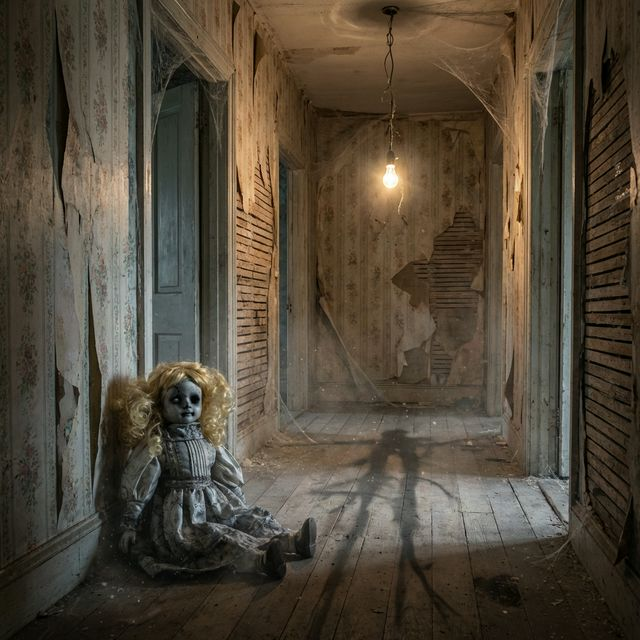
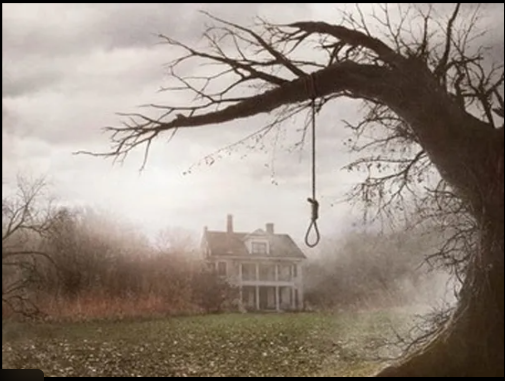

<div align="center">

# 🕯️ THE HOUSE THAT BREATHES
### *A Live Procedural Horror Experience*


 


<br>

> *"This place smells like dust... and something rotten."*

<br>

</div>

---

## 💀 Overview

**The House That Breathes** is a hybrid web-horror engine that pushes the boundaries of browser-based immersion. It abandons heavy video assets in favor of a **code-driven engine** that synthesizes Fear in real-time.

By leveraging the **Web Audio API** for procedural soundscapes and **CSS3** for cinematic visuals, this project delivers a studio-quality horror experience entirely in the browser, with **zero external dependencies**.



### 🩸 Glimpse of the Horror

> *We found these files on the camera... they shouldn't exist.*

<div align="center">
  
  
</div>


---

## 🩸 Key Features

### 🔊 Procedural Audio Engine
No pre-recorded loops. The engine generates audio mathematically in real-time:
*   **Dynamic Soundscapes**: Industrial drones, floor creaks, and atmospheric tension synthesized on the fly.
*   **Binaural Audio**: Spatial audio effects simulating 3D sound positioning.

### 🎥 Cinematic Visuals (No Video Files)
Visuals are rendered natively using advanced CSS3 techniques:
*   **"Ken Burns" Camera Work**: Smooth pan and zoom effects via CSS transforms.
*   **Neural Canvas**: A dynamic canvas layer mimicking "glitches" and paranormal signal intrusions using pixel manipulation.
*   **Film Grain & Lighting**: Dynamic lighting and grain effects created with CSS filters and blend modes.

### 🗣️ Emotional Speech Synthesis
A custom `VoiceEngine` manipulates the browser's **SpeechSynthesis API** to deliver dialogue with emotional nuance—whispering, trembling, and screaming—without voice actors.

---

## 🛠️ Technology Stack

This project was architected using **Antigravity AI** and follows the **Vibe Coding** methodology.

| Component | Technology | Description |
| :--- | :--- | :--- |
| **Core Logic** | `JavaScript (ES6+)` | Async/Await event loop for timing scenes. |
| **Audio** | `Web Audio API` | Oscillators & Gain Nodes for sound generation. |
| **Visuals** | `CSS3 / HTML5 Canvas` | Hardware-accelerated animations & pixel manipulation. |
| **Acting** | `SpeechSynthesis API` | Pitch/Rate modulation for generative voice acting. |

---

## 🚀 Getting Started

### Prerequisites
No backend or build tools required. Pure client-side application.

### Installation
1.  **Clone the Repository**
    ```bash
    git clone https://github.com/AbhayPotle/Horror-scenes.git
    cd Horror-scenes
    ```
2.  **Run Locally**
    Open `index.html` in any modern web browser (Chrome/Edge recommended for optimal Speech Synthesis support).

---

## 🕹️ The Experience (Episode 1)
**Feature Pilot: "The Arrival"**
1.  **The Scent**: The mother notices a rotting smell.
2.  **The Signal**: An unknown entity interrupts the broadcast frequency.
3.  **The Climax**: A procedurally triggered jumpscare event.

---

<div align="center">

## 👨‍💻 Author

**Abhay**  
*Built with the assistance of Google's Antigravity AI.*

<br>

*© 2026 Horror Scenes Project. All signals are simulated. You are safe.*

</div>