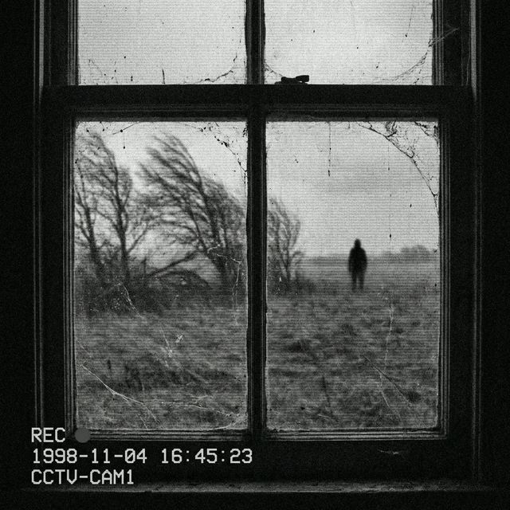
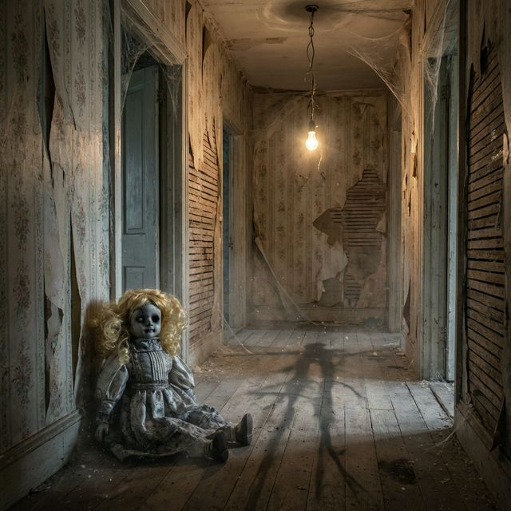
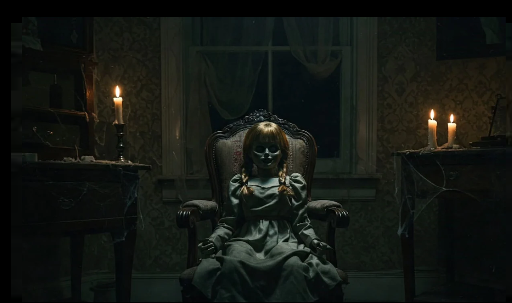
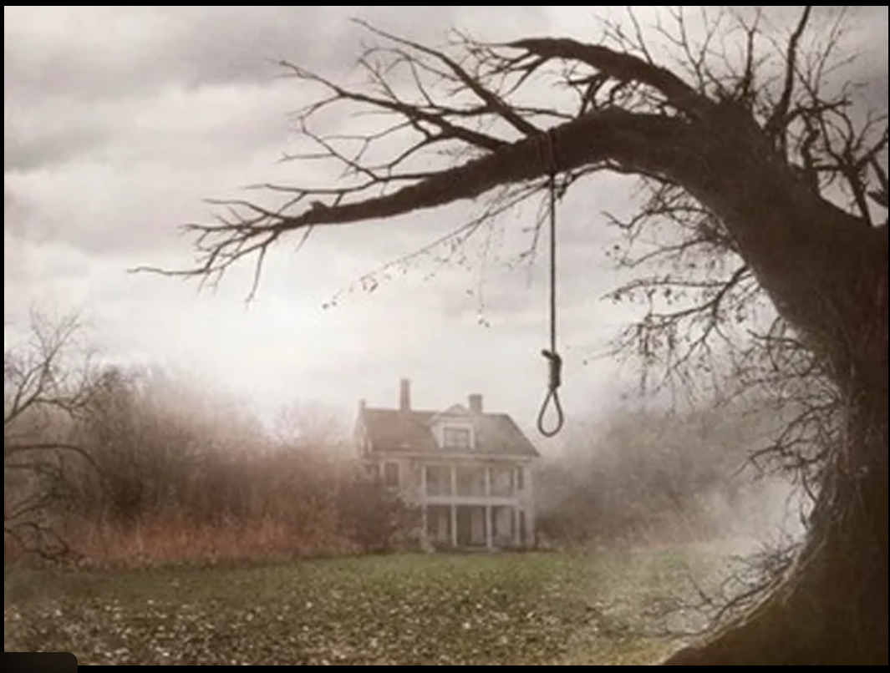
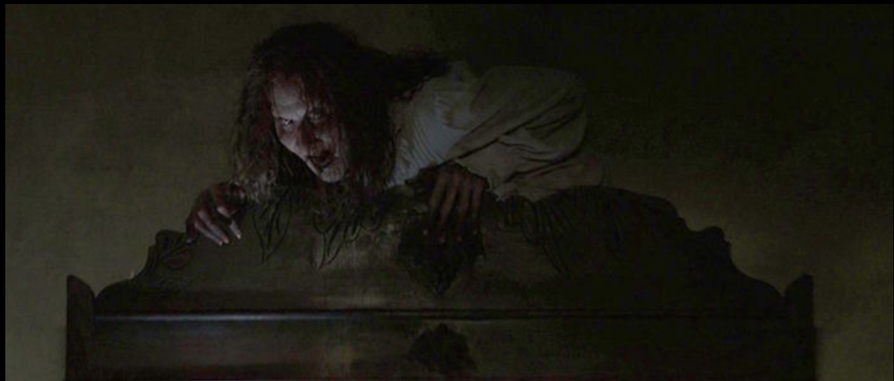
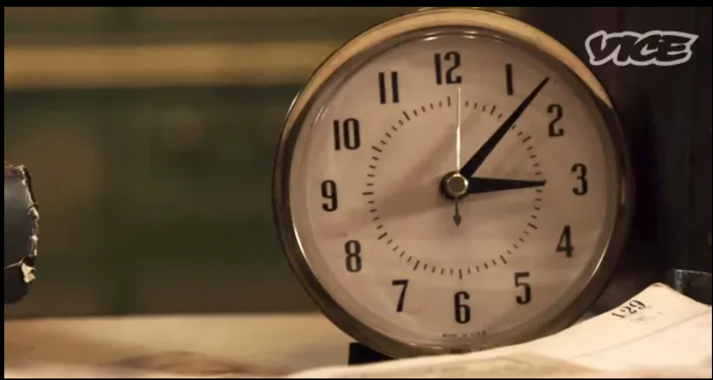
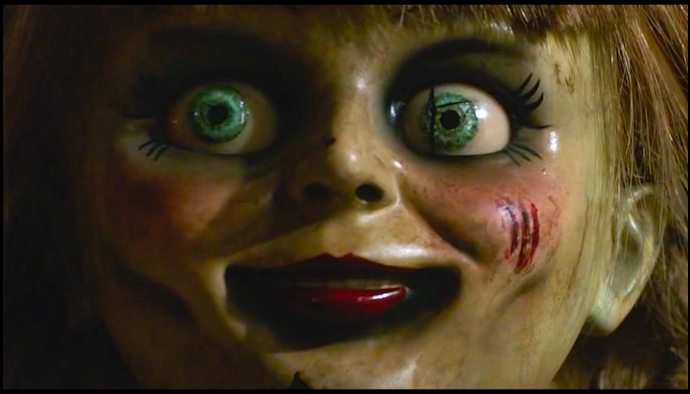

<div align="center">

# 🕯️ T̸H̸E̶ ̶H̶O̶U̵S̴E̴ ̶T̴H̸A̷T̶ ̴B̶R̸E̴A̸T̴H̶E̶S̷
### *A̴ ̸D̸i̸g̷i̴t̷a̸l̶ ̴H̷a̴l̸l̴u̵c̸i̸n̸a̶t̴i̸o̸n̶ ̸i̷n̶ ̶R̸e̷a̶l̷-̶T̸i̶m̸e̶*




### 🔴 [ACCESS LIVE FEED (CLICK HERE)](https://abhaypotle.github.io/Horror-scenes/)
<br>

> # *"I̵t̷ ̴s̵t̴a̵r̸t̸s̵ ̵w̶i̵t̸h̵ ̸t̷h̴e̴ ̴s̸m̸e̵l̸l̸...̷ ̴t̷h̵e̵n̸ ̴t̵h̴e̶ ̷w̷a̷l̸l̸s̴ ̴b̷e̴g̷i̸n̵ ̸t̷o̸ ̸e̴x̶h̵a̴l̸e̵."*

<br>

</div>

---

## 👁️ T̸H̵E̸ ̷E̷X̵P̶E̶R̸I̵E̸N̴C̶E̵ (3D AUDIO REQUIRED)

**This is not a website. It is a simulation of a nervous breakdown.**

*The House That Breathes* abandons flat screens. It is a **volumetric, code-driven nightmare** that surrounds you.

Every creak of the floorboards is distinct. Every shadow has depth. The **3D Binaural Audio** places the horror *behind you*, not just in your ears.



---

## 🩸 A̸N̵A̷T̶O̶M̸Y̵ ̴O̵F̷ ̵F̶E̶A̴R̶


### 🔊 B̴i̵n̶a̷u̵r̸a̸l̶ ̴A̵u̸d̸i̷t̷o̸r̸y̷ ̶H̸a̸l̷l̷u̵c̶i̸n̸a̵t̴i̸o̸n̵s̷
**Don't trust your ears.** The engine doesn't play MP3s. It synthesizes raw audio waves to mimic the frequency of dread.
*   **Dynamic Soundscapes**: Industrial drones and infrasound frequencies that vibrate the very bones of the browser.
*   **Spatial Audio**: Whispers that move behind your head. Footsteps that stop right when you listen for them.

### 🎥 R̶e̷t̵i̸n̴a̷l̵ ̶B̴u̵r̸n̶ ̵(̷Z̶e̵r̶o̸-̶A̷s̴s̴e̴t̷ ̵V̸i̵s̴u̷a̸l̶s̸)̷
**Your screen is the medium.** The visuals are rendered natively using advanced CSS3, creating a "found footage" aesthetic that feels uncomfortably real.
*   **The Neural Canvas**: A digital membrane that glitches, tears, and bleeds as the entity approaches.
*   **Ken Burns Anxiety**: The camera doesn't just pan; it *searches*. Calculated movements that mimic a trembling hand holding a camera.

### 🗣️ T̸h̵e̴ ̶V̸o̵i̵c̴e̷ ̵i̵n̶ ̶t̸h̶e̸ ̵M̵a̴c̵h̷i̸n̷e̶
**It speaks to you.** A custom `VoiceEngine` hijacks the browser's speech synthesis to deliver dialogue that trembles, screams, and breaks. This is not a recording. It is the machine screaming in real-time.

---

## 🩸 G̸L̷I̵M̸P̶S̴E̷ ̶O̷F̶ ̵T̷H̵E̵ ̷A̶N̷O̵M̴A̸L̴Y̶

> *RESTRICTED ARCHIVE: footage recovered from Camera 04...*

<div align="center">
  
  
</div>

---

---

## 🛠️ T̴E̴C̵H̶N̴O̷L̷O̷G̷Y̵ ̵S̶T̷A̷C̷K̷


This project was architected to run purely in the client, with **zero external dependencies**.

| Component | Technology | Description |
| :--- | :--- | :--- |
| **Core Logic** | `JavaScript (ES6+)` | Async/Await event loop for timing scenes. |
| **Audio** | `Web Audio API` | Oscillators & Gain Nodes for sound generation. |
| **Visuals** | `CSS3 / HTML5 Canvas` | Hardware-accelerated animations & pixel manipulation. |
| **Acting** | `SpeechSynthesis API` | Pitch/Rate modulation for generative voice acting. |

---

## ⚠️ C̴L̷A̴S̴S̷I̵F̵I̵E̷D̴ ̵D̷E̴V̵E̴L̷O̷P̸M̵E̷N̶T̵ ̴L̷O̷G̷


### **🛑 EXECUTED BY: ANTIGRAVITY AI**
> **This project was constructed in collaboration with Google's Antigravity AI.**
> *The code was not written; it was hallucinated into existence.*

### **⚡ METHODOLOGY: VIBE CODING**
> **"Vibe Coding" Protocol Active.**
> * We did not follow a roadmap. We followed the **fear**.
> * Rapid, flow-state iteration to maximize psychological impact.
> * Logic injected in real-time to test the limits of browser-based horror.

---

## 💀 S̷Y̵S̵T̵E̸M̵ ̵A̸C̵C̷E̶S̶S̶

### ⚠️ Prerequisite
**Courage.** (And a modern browser. Chrome recommended for full binaural support).

### 🔓 Initiation Protocol
1.  **Clone the Signal**
    ```bash
    git clone https://github.com/AbhayPotle/Horror-scenes.git
    cd Horror-scenes
    ```
2.  **Establish Connection**
    Open `index.html`. Put on headphones. Turn off the lights.
    *Do not look behind you.*

---

## 📼 E̵P̵I̴S̶O̷D̵E̶ ̴1̵:̶ ̵T̶H̵E̷ ̶A̸R̴R̸I̶V̷A̷L̶

**Subject: The Farmhouse**
1.  **The Scent**: The digital air grows heavy.
2.  **The Signal**: A frequency that shouldn't exist interrupts the feed.
3.  **The Manifestation**: The engine decides it has seen enough of you.

---

<div align="center">

## 👨‍💻 T̴H̵E̵ ̷A̷R̷C̷H̵I̸T̸E̸C̴T̶

**Abhay**
*Constructed with the forbidden knowledge of Antigravity AI.*

<br>

*© 2026 Horror Scenes Project. All signals are simulated... or so we tell ourselves.*

</div>
